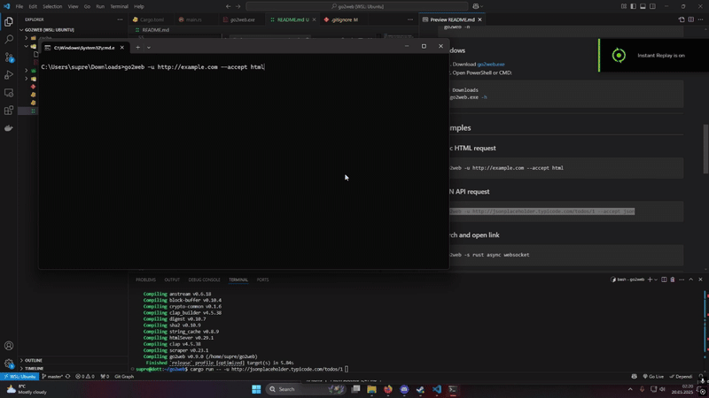

# go2web

A simple, no-dependency CLI web client built in Rust for Lab 5 - Websockets.

Supports raw HTTP requests, search engine parsing, link opening, response caching, and content negotiation without using HTTP client libraries. GUI applications are not allowed.

---

## Features (Lab Points)

### CLI Options (6 pts)

```bash
go2web -u <URL>         # Make a raw HTTP request and print the response
go2web -s <search-term> # Search a term using DuckDuckGo and show top 10 results
go2web -h               # Show help message
```

### Human-readable output

* HTML responses are cleaned: no tags, only visible text from `<body>`
* JSON responses are pretty-printed

### Search Result Parsing (+1 bonus)

* Shows top 10 links from DuckDuckGo
* Lets you choose a result to open in your browser

### Redirect Handling (+1 bonus)

* Automatically follows `http://` redirects
* Logs and skips `https://` redirects (per lab restrictions)

### HTTP Caching (+2 bonus)

* Stores responses in `.cache/` folder based on URL hash
* On repeated requests, asks: *"Use cached response? (y/N)"*

### Content Negotiation (+2 bonus)

* Supports `--accept html` or `--accept json`
* Sends correct `Accept:` header
* Parses content accordingly

### Raw TCP + HTML/JSON parsing only

* No `reqwest`, no `ureq`, no `hyper`
* Uses only `TcpStream`, `scraper`, `serde_json`, and `clap`

---

## Installation

### Linux (WSL, Ubuntu, Arch, etc.)

```bash
wget https://github.com/YOUR_USERNAME/go2web/releases/download/v1.0.0/go2web
chmod +x go2web
sudo mv go2web /usr/local/bin/
go2web -h
```

### Windows

1. Download [go2web.exe](https://github.com/YOUR_USERNAME/go2web/releases/download/v1.0.0/go2web.exe)
2. Open PowerShell or CMD:

```powershell
cd Downloads
.\go2web.exe -h
```

---

## Examples

### Basic HTML request

```bash
go2web -u http://example.com --accept html
```

### JSON API request

```bash
go2web -u http://jsonplaceholder.typicode.com/todos/1 --accept json
```

### Search and open link

```bash
go2web -s rust async websocket
```

---

## Demo GIF



> Include this GIF by recording with [Peek](https://github.com/phw/peek) or `asciinema`, and place it in the `demo/` folder of your repo.

---

## Build from source

```bash
git clone https://github.com/YOUR_USERNAME/go2web.git
cd go2web
cargo build --release
./target/release/go2web -h
```

---

## Grading Checklist (Lab 5)

* `-h`, `-u`, and `-s` options (6 pts)
* Clean, human-readable output
* Top 10 links with open (1 pt bonus)
* HTTP redirect support (1 pt bonus)
* Caching mechanism (2 pts bonus)
* Content negotiation (2 pts bonus)
* Well-structured git history with multiple stages

Total: **6 base + 6 bonus = 12/10**
